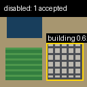
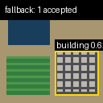
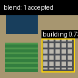

# Grounding score-mode comparison

- Image: `/Users/anirudhshashikumar/Documents/Projects/SatQuery AI/sar-colorization-app/satquery_agent/demo_samples/single-optical.png`
- Query: `Locate the buildings.`
- Grounding backbone: the same lazily loaded Grounding DINO instance for every mode
- One-time Grounding DINO initialization: `1812 ms`

| Mode | Accepted | Rejected | Top accepted score | Wall runtime (ms) | Same boxes/labels as disabled | Fallback |
|---|---:|---:|---:|---:|---|---|
| disabled | 1 | 2 | 0.624469 | 2358 | baseline | no |
| fallback | 1 | 2 | 0.624469 | 1200 | true | specialist_scores_extremely_small |
| blend | 1 | 2 | 0.737128 | 1173 | true | no |
| specialist_only | 0 | 3 | — | 1173 | false | no |

## Accepted detections

### disabled

| Label | Score | Pixel box | Normalized box |
|---|---:|---|---|
| building | 0.624469 | `[68, 63, 122, 118]` | `[0.53125, 0.492188, 0.953125, 0.921875]` |

Score-policy diagnostics:

| Proposal | Original DINO | Specialist | Final | Calibration | Fallback reason |
|---:|---:|---:|---:|---|---|
| 0 | 0.62446922 | — | 0.62446922 | — | — |
| 1 | 0.39528528 | — | 0.39528528 | — | — |
| 2 | 0.37613022 | — | 0.37613022 | — | — |

### fallback

| Label | Score | Pixel box | Normalized box |
|---|---:|---|---|
| building | 0.624469 | `[68, 63, 122, 118]` | `[0.53125, 0.492188, 0.953125, 0.921875]` |

Score-policy diagnostics:

| Proposal | Original DINO | Specialist | Final | Calibration | Fallback reason |
|---:|---:|---:|---:|---|---|
| 0 | 0.62446922 | 0.02515921 | 0.62446922 | identity_probability | specialist_scores_extremely_small |
| 1 | 0.39528528 | 0.00368637 | 0.39528528 | identity_probability | specialist_scores_extremely_small |
| 2 | 0.37613022 | 0.01188891 | 0.37613022 | identity_probability | specialist_scores_extremely_small |

### blend

| Label | Score | Pixel box | Normalized box |
|---|---:|---|---|
| building | 0.737128 | `[68, 63, 122, 118]` | `[0.53125, 0.492188, 0.953125, 0.921875]` |

Score-policy diagnostics:

| Proposal | Original DINO | Specialist | Final | Calibration | Fallback reason |
|---:|---:|---:|---:|---|---|
| 0 | 0.62446922 | 0.02515921 | 0.73712845 | min_max_probability_normalization | — |
| 1 | 0.39528528 | 0.00368637 | 0.27669969 | min_max_probability_normalization | — |
| 2 | 0.37613022 | 0.01188891 | 0.37788992 | min_max_probability_normalization | — |

### specialist_only

No accepted detections.

Score-policy diagnostics:

| Proposal | Original DINO | Specialist | Final | Calibration | Fallback reason |
|---:|---:|---:|---:|---|---|
| 0 | 0.62446922 | 0.02515921 | 0.02515921 | identity_probability | — |
| 1 | 0.39528528 | 0.00368637 | 0.00368637 | identity_probability | — |
| 2 | 0.37613022 | 0.01188891 | 0.01188891 | identity_probability | — |

## Production-safety check

Fallback preserved the disabled-mode accepted Grounding DINO result: **true**.

