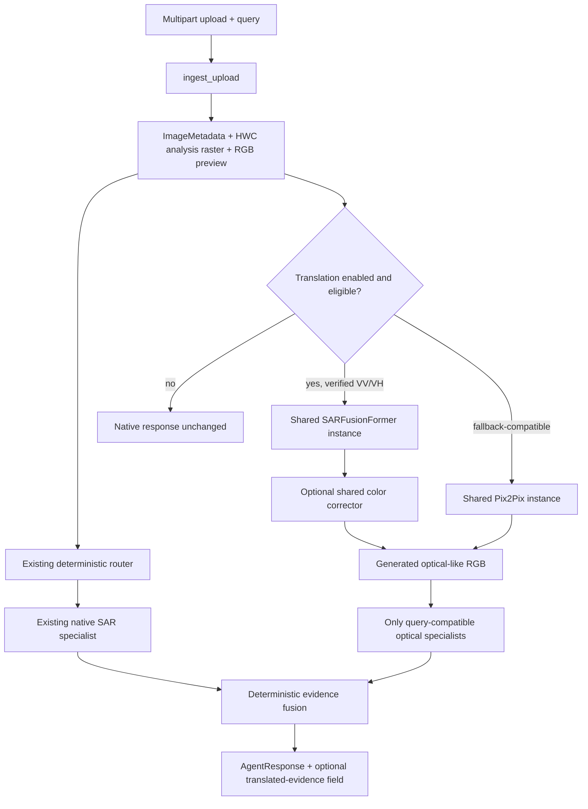

# Single-Image SAR Pipeline Audit

## Scope

This audit covers the production `POST /api/agent/query` single-image path and the existing local SAR-to-optical implementations. It records the state before the optional translated-evidence integration. No routing or inference behavior was changed while producing this audit.

## Authoritative request path

1. `backend.py` creates the FastAPI application and includes `satquery_agent.api.router`.
2. `satquery_agent/api.py::agent_image_query` accepts the multipart request, calls `image_ingestion.ingest_upload`, applies the explicit/derived modality, routes with `router.route_query`, validates the selected tool, executes one primary specialist, optionally adds SVE evidence, and constructs `models.AgentResponse`.
3. `satquery_agent/image_ingestion.py::ingest_upload` validates bytes and metadata, creates an `ImageMetadata`, stores a secure preview, and returns `IngestedImage`.
4. `satquery_agent/router.py::classify_query` gives SAR-specific water, quality, and scene requests precedence. Other questions retain the existing task rules. `route_query` selects the existing specialist IDs without model-based routing.
5. `satquery_agent/api.py` closes each `IngestedImage.model_image` after response assembly and uses the existing mission/cache/reporting stores.

The backend helper `backend.py::_agent_single_image_query` calls the same `agent_image_query` function used by the public endpoint; there is no second agent execution implementation.

## Ingestion contracts

`IngestedImage` contains:

| Field | Contract | Current consumer |
|---|---|---|
| `metadata` | Pydantic `ImageMetadata`; original dimensions, bands, dtype, representation, effective modality, safe preview URL | router and all specialists |
| `model_image` | owned PIL RGB copy of the ingestion display preview, maximum dimension 1024 | captioner, grounder, SVE, RSVQA |
| `analysis_raster` | contiguous HWC NumPy array, at most three channels and maximum analysis dimension 1024 | native SAR and deterministic optical evidence |
| `bands_used` | display band labels | model disclosures |
| `image_representation` | textual description of the rendered representation | model disclosures |
| `content_hash` | SHA-256 of uploaded bytes | cache/model reuse |
| `source_bytes` | bounded original bytes | retained by request object; not logged |

For TIFF/GeoTIFF, ingestion preserves one or two channels in `analysis_raster` when those are present. PNG/JPEG grayscale data remains one channel in the raster, while `model_image` is RGB for display/model compatibility. Two-band previews are rendered as `R=band 1`, `G=band 2`, `B=mean`; this rendering is not a scientific RGB product.

## Native SAR branch

`satquery_agent/specialists/sar_preprocessing.py::preprocess_sar` accepts HWC one- or two-channel numeric arrays. It excludes non-finite/NoData values, performs independent 1st/99th-percentile normalization, forms a channel mean for native statistics, and optionally applies a 3×3 median filter. It does not apply an undocumented logarithmic conversion.

`satquery_agent/specialists/sar_scene.py::analyze_sar_scene` reports valid-pixel percentage, low/mid/high normalized-return proportions, normalized mean/standard deviation, a gradient-derived texture index, and input-quality score. It stores a normalized SAR preview. Its answer explicitly avoids semantic land-cover claims.

`satquery_agent/specialists/sar_water.py::analyze_sar_water` applies a conservative low-return threshold, morphology, and connected components. It reports candidate pixel/area statistics, regions, reliability, quality, and secure preview/mask/overlay URLs. It is a deterministic candidate detector, not a trained segmentation model.

## Existing translation implementations

### SARFusionFormer

- Architecture: `sarfusionformer.py::SARFusionFormer`.
- Existing loader: `backend.py::load_sarfusionformer`.
- Existing checkpoint: `SARFUSIONFORMER_CHECKPOINT`, defaulting to `models/checkpoints/sarfusionformer_256_decoder_best.pt` relative to the workspace parent.
- Input: exactly two real-valued SAR channels interpreted as VV then VH; each is normalized independently using finite 1st/99th percentiles and bilinearly resized to a float32 tensor shaped `[1, 2, 256, 256]`.
- Output: `model(tensor)["lab"]`, shaped `[1,3,H,W]`, converted by `sarfusionformer.lab_to_rgb` to finite float RGB in `[0,1]`.
- Existing inference helper: `backend.py::sarfusionformer_generate`.
- Optional corrector: `backend.py::ColorCorrectionNet`, a three-channel 1×1-convolution residual network loaded from `COLOR_CORRECTOR_CHECKPOINT`.

### Pix2Pix

- Architecture: workspace module `src.pix2pix.Pix2Pix`.
- Existing loader: `backend.py::load_pix2pix`.
- Existing checkpoint: `PIX2PIX_CHECKPOINT`, defaulting to `pix2pix_gen_180.pth` relative to the workspace parent.
- Input: a PIL RGB SAR display image resized to `256×256`, converted to float32 CHW and normalized from `[0,1]` to `[-1,1]`.
- Output: generator tensor converted from `[-1,1]` to a finite PIL RGB image in `[0,255]`.
- Existing inference helper: `backend.py::pix2pix_generate`.

## Current model lifecycle and duplication risk

`backend.py` currently loads Pix2Pix, SARFusionFormer, and the color corrector once at module import into process-global variables. The agent package is imported by `backend.py`, so importing `backend.py` from an agent service would create a circular dependency. Independently instantiating these architectures inside the agent would allocate duplicate checkpoint/model memory when the endpoint is hosted by `backend.py`.

The safe reuse seam is an agent-owned singleton translation service with an explicit `register_external_models(...)` hook. `backend.py` can register its already-loaded instances after existing initialization. The service can retain lazy standalone loaders for deployments that mount only the agent router. The service must serialize inference with a lock and must never inspect/import `backend.py`.

## Optical specialist contracts

- SVE: `services/sve_service.py::SVEManager.analyze(PIL.Image, content_hash, ...)`; lazy, cached, thread-safe and RGB-only.
- Captioner: `specialists/captioner.py::RemoteSensingCaptioner.describe(PIL.Image, ImageMetadata, Modality, bands, representation)`; lazy BLIP loader; optical/RGB-like only.
- Grounder: `specialists/grounder.py::RemoteSensingGrounder.ground(...)`; lazy Grounding DINO plus learned proposal rescoring; boxes are expressed against the `ImageMetadata` dimensions supplied.
- RSVQA: `specialists/rsvqa_specialist.py::RSVQASpecialist.predict(PIL.Image, question, content_hash=...)`; reuses SVE’s OpenCLIP encoder and only accepts the four exported question families.

Translated output must therefore be supplied with generated-image metadata whose dimensions match the generated image. Grounding coordinates cannot be asserted as source-SAR coordinates when the translator resized the source.

## Public response and artifact contracts

`models.AgentResponse` is the authoritative response. Existing fields are all retained. The compatible extension point is one optional nested model. `ExecutionStep` already supports bounded stage timing metadata. `image_ingestion.save_preview` writes randomized PNG names to the configured temporary preview directory and returns `/api/agent/previews/<uuid>.png`; `preview_file_path` protects retrieval against path traversal.

## Observed failure modes

- Missing translation/checkpoint dependency currently makes the dedicated reconstruction model unavailable.
- SARFusionFormer cannot accept an unverified single channel, a swapped/unverified pair, or a band count other than two.
- A display preview does not establish VV/VH semantics even when it has two visible channels.
- Non-finite or constant rasters can be invalid or low-information.
- Translation, color correction, artifact storage, or any optional optical specialist can fail independently.
- The optical specialists reject raw SAR by contract; generated RGB must remain explicitly labelled and passed through a generated metadata contract.
- Generated images may hallucinate, omit, or distort structure. Their output cannot override direct SAR measurements without deterministic agreement evidence.
- Mission caching must include translation flags/model selection or an enabled request could reuse a disabled-path response.

## Recommended integration boundary

Use `satquery_agent/services/sar_translation_service.py` as the only translation lifecycle owner seen by the agent. Register backend-owned models when they already exist. Keep all translation/fusion execution behind `SATQUERY_SAR_TRANSLATION_ENABLED=1`. Add one optional `sar_translated_optical_analysis` field to `AgentResponse`, add bounded execution stages, and leave `router.py` unchanged.

