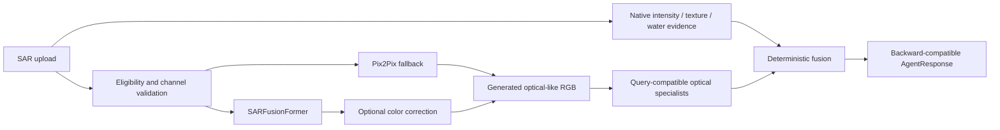

# Single-Image SAR Translation Evidence

SatQuery can optionally add a learned SAR-to-optical branch to the existing single-image SAR workflow. It is disabled by default. Native SAR evidence remains separate and authoritative; the generated image is secondary interpretive evidence only.

## Architecture



The service reuses the model objects already loaded by `backend.py`. In agent-only deployments it lazily loads the configured model, keeps it for subsequent requests, and serializes inference with a lock. A model is never loaded per request.

## Feature flags

| Variable | Default | Meaning |
|---|---|---|
| `SATQUERY_SAR_TRANSLATION_ENABLED` | `false` | Master switch. No new workflow executes unless this is `1`/`true`. |
| `SATQUERY_SAR_TRANSLATION_MODEL` | `sarfusionformer` | Preferred model: `sarfusionformer` or `pix2pix`. |
| `SATQUERY_SAR_TRANSLATION_USE_COLOR_CORRECTION` | availability-dependent | Uses the existing corrector for SARFusionFormer output. |
| `SATQUERY_SAR_TRANSLATION_OPTICAL_SPECIALISTS_ENABLED` | `true` | Allows selective SVE/caption/grounding/RSVQA evidence. |
| `SATQUERY_SAR_TRANSLATION_SAVE_ARTIFACTS` | `true` | Stores previews in the existing secure temporary artifact store. |
| `SATQUERY_SAR_TRANSLATION_DEVICE` | `auto` | `auto`, `cuda`, `mps`, or `cpu`. |

Changing flags requires no endpoint or frontend change. Translation settings participate in the response cache identity.

## Supported inputs

SARFusionFormer is used only for a scientific two-band input whose effective modality and metadata/user confirmation establish channel 1 as VV and channel 2 as VH. It applies finite-value 1st/99th-percentile normalization per channel and resizes the pair to `256×256`. It never duplicates a single channel.

Pix2Pix consumes the existing ingestion-generated SAR display. A grayscale display is explicitly converted to RGB; a two-band raster uses the existing documented false-color preview. This conversion is disclosed in `input_channel_interpretation` and is not represented as a physical VV/VH pair.

Malformed, empty, non-numeric, complex, unsupported-band, and all-non-finite inputs are skipped safely. Native SAR processing remains available whenever its own input contract passes.

## Evidence distinctions and fusion

The optional response field is `sar_translated_optical_analysis`. It includes native findings, translated findings, artifacts, model provenance, runtimes, warnings, and one deterministic agreement state:

- `supported_by_both`
- `supported_by_native_sar_only`
- `suggested_by_translation_only`
- `conflicting_evidence`
- `insufficient_evidence`
- `translation_unavailable`

No LLM determines agreement. A generated building observation, for example, remains `suggested_by_translation_only` because native intensity statistics do not establish building identity. Water can be `supported_by_both` only when native low-backscatter/water evidence and controlled translated evidence agree. Poor native input quality lowers fused confidence.

Every successful generated branch includes this disclosure:

> This optical-like image is generated from SAR by a learned translation model. It is not an observed optical image and may contain hallucinated, omitted, or spatially distorted features.

Grounding and RSVQA add their own visible disclosures. Grounding boxes use generated-image coordinates. SatQuery does not map them back to source coordinates because the learned resize/translation is not a verified invertible spatial transform.

## Specialist selection

The existing router is unchanged. The translated branch uses existing classifiers and runs only relevant supporting specialists:

- SVE provides scene-level priors when enabled.
- The captioner runs for descriptive requests.
- Grounding runs only for a recognized grounding query and supported target.
- RSVQA runs only for one of its exported presence, comparison, count, or rural/urban families.

An individual specialist failure is converted to a safe warning and does not stop other evidence or native SAR analysis.

## Health and startup

`GET /api/agent/health` includes `specialists.sar_translation_service` with `enabled`, lifecycle, selected model, device, fallback/corrector availability, and load/reuse counts. The root `GET /health` exposes the same entry alongside existing reconstruction models.

Lifecycle values are `disabled`, `unloaded`, `loading`, `ready`, and `failed`. Failure is sticky until the service is explicitly retried, preventing repeated checkpoint load attempts during a failing deployment.

## Example response fragment

```json
{
  "sar_translated_optical_analysis": {
    "enabled": true,
    "status": "completed_with_limitations",
    "model": "SARFusionFormer",
    "generated_preview_url": "/api/agent/previews/<random-id>.png",
    "agreement": "suggested_by_translation_only",
    "direct_answer": "The generated optical-like representation suggests ...",
    "disclosure": "This optical-like image is generated from SAR by a learned translation model. It is not an observed optical image and may contain hallucinated, omitted, or spatially distorted features.",
    "optical_specialists_executed": ["satquery_vision_encoder_v1"],
    "warnings": [],
    "limitations": []
  }
}
```

## Troubleshooting

- `disabled`: set `SATQUERY_SAR_TRANSLATION_ENABLED=1` and restart the host.
- `translation_unavailable`: inspect the safe warning and health entry. Verify checkpoint paths and the requested input/channel contract.
- SARFusionFormer skipped: confirm a scientific two-band VV/VH raster and correct channel order.
- Pix2Pix fallback used: review `fallback_reason` and `input_channel_interpretation`.
- No optical caption/boxes/answer: the query may not select that specialist, the optional specialist may be disabled, or it may have failed safely.

## Tests and smoke command

```bash
PYTHONPATH=. pytest -q tests/test_sar_translation_service.py tests/test_single_image_sar.py
PYTHONPATH=. python scripts/run_single_sar_translation_smoke.py \
  --sample satquery_agent/demo_samples/cross-sar.tif \
  --output-dir artifacts/single_sar_translation_smoke
```

The smoke runner performs a native-only request, an enabled request, and a preferred-model/fallback request. It writes JSON results, warnings, a timeline CSV, a comparison, a Markdown report, and the generated preview when available.

